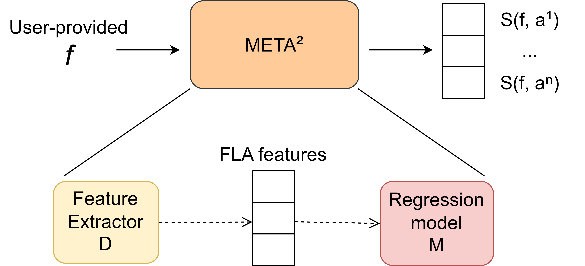

# META² - Meta-heuristics meta-modeling



META² is a meta-model designed to predict performances of meta-heuristics on arbitrary optimization problems.

This readme provides instructions to build, use and extend the model.

## Building META²
This section presents the instructions to define and build versions of the META² model.

Building a version of the model involves the creation of the training set - which entails defining a set of functions and computing the performance scores and the FLA features on them - and the training of the regression model.

Building a version of the model can be done in the **test** mode, which uses a *train-and-test* split to evaluate the model's performances, and **train** mode, which uses the entire dataset to train the model.

Due to the way data augmentation is applied to the set of functions, and the need to produce disjointed sets for the *train-and-test* split, the datasets built in one of the two modes cannot be re-used for the other.


The first step is to clone the META² repository:
```
git clone https://gitlabtsgroup.polito.it/saisei/META2.git
```

### Build the environment with Singularity
The simplest and recommended way to set-up the environment to run the META² model is to use the provided Singularity Definition file to build the environment in a container.
1) Install `Singularity` from https://docs.sylabs.io/guides/3.0/user-guide/installation.html:
	* Install `Singularity` release 3.10.2, with `Go` version 1.18.4
	* Suggestion: follow instructions provided in _Download and install singularity from a release_ section after installing `Go`
	* Install dependencies from: https://docs.sylabs.io/guides/main/admin-guide/installation.html
2) Move to the META² repository directory and run the build script:
    ```
    cd META2
    sh build_container.sh <PATH_TO_CONTAINER>
    ```
    If <PATH_TO_CONTAINER> is not provided, by default the container is created in the parent directory of the repository and named "META2".

3) Open a shell inside the container:
    ```
    sh run_container.sh <PATH_TO_CONTAINER>
    ```
    As in step 2, <PATH_TO_CONTAINER>, if not provided, defaults to "../META2".

### Build the environment with a python virtual-env
In a Linux machine it is possible to set-up the environment manually.
* Make sure Python3, Pip, python3-setuptools and the Make utility are installed.
* Enter the repository directory: `cd META2`
* (Optional) create a virtual environment: `python -m venv env`
* (Optional) activate the virtual environment: `env/bin/activate`
* Install requirements: `pip install -r requirements.txt`

### Train META²
With a shell opened inside the Singularity container, or with the environment manually configured, it is possible to build new versions of the META² framework:

#### Create version and configuration
The first step is to create a _version_ of the model. A _version_ is defined by its own configuration and its path. The creation of versions is managed by the _makefile_ in the _src_ directory:
```
cd src
make dataset/<VERSION_NAME>/
```
This results in the creation of the directory `src/dataset/<VERSION_NAME>`. The directory initially contains only the _config.json_ file.

#### (Optional) Modify the model configuration

Before running the training process, it is possible to modify the configuration file in `src/dataset/<VERSION_NAME>/config.json`. The parameters are:
* **OPTIMIZATION_BUDGET**: default number of function evaluations available to the meta-heuristics considered by the model. Can be modified to adapt the model to scenarios with different computational resources available. Defaults to *10,000*.
* **REPEAT_BENCHMARK**: number of repetitions for the optimization steps in the training set generation. Higher values result in a more precise training dataset for the model, at the cost of a longer build time. Does not affect the inference time. Defaults to *16*.
* **MULTI_PROCESS**: number of processes spawn during the training dataset generation. Defaults to *16*.
* **FLA_PARAMS**: set of parameters to specify the computational budget assigned to feature extraction. Affects both building time and inference time.
    * **random_sample_N**: number of uniformely sampled points used in the FLA feature extraction. Defaults to *800*.
    * **jensens_inequality_N**: number of additional function evaluation used for the *Jensen's Inequality Ratio* estimate. Defaults to *200*.
    * **FEM_params**: specific for the First Entropic Measure used by the feature extractor.
        * **epsilon**: vector of numbers. The FEM measure is repeated for each *epsilon* value, corresponding to different threshold to characterize neutral or non-neutral steps.
        * **random_walks**: each object represent a random walk taken on the target functions and used to compute a FEM measure. The *random_walk_len* specifies the number of function evaluations required, the *step_size* influence the local-vs-global nature of the measure taken.
        * **repeat_random_walk**: each random walk in *random_walks* is repeated N. times.

#### Train and test the model
This command builds the model with the *train-and-test* split and produces a set of metrics measuring the quality of the model.
```
cd src
make dataset/<VERSION_NAME>/test_results/plots
```
Running this command results in a set of intermediate files being produced:
* *test_functions.pickle*: contains two sets of functions, used respectively to build the training and testing set.
* *test_scores_raw.pickle*: raw fitness scores produced by optimizing each function in *test_functions.pickle* with each meta-heuristics *REPEAT_BENCHMARK* times.
* *test_scores.pickle*: normalized performance scores obtained from *test_scores_raw.pickle*.
* *fla_test.pickle*: FLA features extracted from the functions in *test_functions.pickle*.
#### Train and build the model on the full dataset
This command builds the dataset and use it entirely to train the model, which is expored as a *pickle* file.
```
cd src
make dataset/<VERSION_NAME>/model.pickle
```
As in the testing phase, a number of intermediate files are produced:
* *train_functions.pickle*: contains the sets of functions used to build the training set.
* *train_scores_raw.pickle*: raw fitness scores produced by optimizing each function in *train_functions.pickle* with each meta-heuristics *REPEAT_BENCHMARK* times.
* *train_scores.pickle*: normalized performance scores obtained from *train_scores_raw.pickle*.
* *fla_train.pickle*: FLA features extracted from the functions in *train_functions.pickle*.

## Running META²
A META² class is provided to interactively use the built model.This step requires having built a model, in the form `src/dataset/<VERSION_NAME>/model.pickle`.

1) Wrap your custom problem in a class following the BaseProblem interface, provided in `src/problems/BaseProblem.py`
2) Import the META2 class and create an instance providing the version name: `meta2 = META2("<VERSION_NAME>")`
3) Run `meta2.predict(problem_instance)`

### Example
```
#Import META2 and the BaseProblem wrapper
from src.META2 import META2
from src.problems.BaseProblem import BaseProblem

#Define your problem by extending BaseProblem
class MyProblemWrapper(BaseProblem):
    def __init__(self):
        self.name = "My Example Function"
        #Example function has 3 independent variables
        self.dimensions = 3
        #with ranges in [-1,1]
        self.ranges = [[-1,1]]*3
    #Implement the fitness function
    def get_value(self, point: np.ndarray) -> float:
        return np.sum(point) 

#Create instance of META2:
meta2 = META2("VERSION_1") #replace with <YOUR_VERSION_NAME>
predictions = meta2.predict(MyProblemWrapper())
```

## Extending META²
This section provides instructions on how to extend the components of the META² framework.

### Extending the function set F
F is the set of function used to build the training set of the model. It implicitly defines the universe of functions for which the model can be assumed to generalize. It is defined in the file `src/problems/functions.py`. This file implements three methods used by the framework:
* _get_base_functions()_: returns the set of benchmark functions used to build the training set.
* _get_function_test()_: returns two disjointed set of benchmark functions used to build the training and the test set, as well as two arrays of names. The current implementation simply returns a random split of the functions in _get_base_functions()_ taking advantage of their *name* field to separate them. If the new functions implemented are named uniquely, this method will not need to be modified.
* _augment_functions(base_functions)_: performs the data augmentation step on the input functions.

To implement new functions, the user must extend the class defined in `src/problems/BaseProblem.py`. Functions must implement methods to access their name, ranges and dimensionality and to compute their value for a given input.

### Extending the algorithm set A
A is the set of algorithms supported by the model. It is defined in the file `src/solvers/algorithms.py`, which defines two methods:
* _get_algorithms_lambdas()_: returns a list of lambda functions that create instances of the meta-heuristics from a given *BaseProblem* instance and an assigned budget of function evaluations.
* _get_algorithms_names()_: returns a list of names of the supported algorithms.

Currently, the framework includes different configurations of four algorithms, *GA, DE, PSO, ABC*. Each algorithm is defined in its own file in `src/solvers/`, and implements a method *get_variants()* that can be modified to easiy add variants of it to the model.
Entirely new algorithms can be defined and must extend the class defined in `src/solvers/BaseSolver.py`. Algorithms must accept a *BaseProblem* and a numerical budget in their constructors and implement the method *solve()*

### Extending the feature extractor D
Feature extraction is implemented in the file `src/fla/FLA.py` by the method *get_FLA_measures()*. Additional measures can be implemented by extending this file, while the specific budget assigned to the FLA measures is specified in the _config.json_.
The FLA features are a black-box to the regression model, thus the *get_FLA_measures()* method can return them as a simple list of values, with no constraint on ordering - as long as it is consistent between training and inference time.

### Modify scoring function F
The scoring function takes the raw fitness values produced by the meta-heuristics on the training set and outputs normalized performance scores. It is possible to define variations of this scoring functions.
The currently used scoring function is implemented in `src/performance_metrics/performance_metrics.py` and is defined as *full_comparison_oriented_scores(raw_scores)*. The input of this function is a numpy array with shape *(N_Algorithms, N_Functions, N_Repetitions)*.
Many possible alternative to this scoring function might need additional information from the set of functions, and this requires not only defining the new scoring function but modifying the function call in the methods *build_scores_test* and *build_scores_train* defined in `src/train.py`